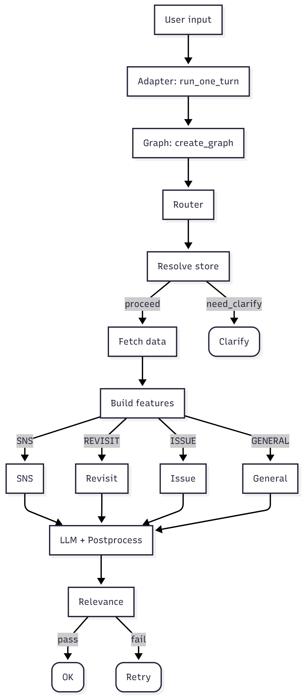

# [1014] 2025 BigContest – AI 비밀상담소 (PoC)

소상공인 가맹점 데이터를 기반으로 전략 초안을 자동 생성하는 에이전트.
LangGraph로 멀티턴·분기·재시도를 제어하고, MCP 툴로 CSV 데이터를 조회한다.
CLI(로컬 테스트)와 Streamlit UI를 제공한다.



<br>

## 폴더 구조

```
2025-BigContest/
├─ my_agent/
│  ├─ __init__.py
│  ├─ agent.py                     
│  └─ utils/
│     ├─ __init__.py
│     ├─ config.py                 
│     ├─ state.py                 
│     ├─ tools.py                  
│     └─ nodes/
│        ├─ router.py              # RouterNode 
│        ├─ sns.py                 # SNSNode (프롬프트 내장)
│        ├─ revisit.py             # RevisitNode (프롬프트 내장)
│        ├─ issue.py               # IssueNode (프롬프트 내장)
│        └─ general.py             # GeneralNode (프롬프트 내장)
│
├─ mcp/
│  ├─ server.py
│  ├─ tools.py
│  ├─ contracts.py
│  └─ adapter_client.py
│
├─ data/
│  ├─ franchise_data.csv
│  ├─ biz_area.csv
│  └─ admin_dong.csv
│ 
├─ assets/
│
├─ streamlit_app.py
├─ local_test.py
├─ .streamlit/
│  └─ secrets.toml
├─ .env
└─ requirements.txt
```

> 데이터 주의: 현재 `data/biz_area.csv`, `data/admin_dong.csv`는 외부데이터 대체 목적의 **임의 더미 데이터**입니다. 

<br>

## 설치 및 실행(uv)
```bash
# 1) 저장소 클론
git clone https://github.com/zziman/2025-BigContest.git
cd 2025-BigContest

# 2) 가상환경 + 의존성 설치
uv venv
source .venv/bin/activate    # Windows: .\.venv\Scripts\Activate.ps1
uv pip install -r requirements.txt

# 3) 시크릿(secrets.toml) 생성 — 권장 방식
cat > .streamlit/secrets.toml <<'TOML'
# --- API Keys ---
GOOGLE_API_KEY = "your_key"     # ★ 필수 (Router/노드가 LLM 전용)

# --- 데이터 경로 ---
FRANCHISE_CSV = "./data/franchise_data.csv"
BIZ_AREA_CSV = "./data/biz_area.csv"
ADMIN_DONG_CSV = "./data/admin_dong.csv"

# --- 정책/토글 ---
CONFIRM_ON_MULTI = 0                      # 1: 후보 다수 시 사용자 확인, 0: 자동 선택
LLM_MODEL = "gemini-2.5-flash"
LLM_TEMPERATURE = 0.2
ENABLE_RELEVANCE_CHECK = true
ENABLE_MEMORY = true

# --- (선택) gRPC 로그 억제 ---
GRPC_VERBOSITY = "ERROR"
GRPC_TRACE = ""
TOML

# 4) (선택) .env로 설정하고 싶다면 — 로컬 개발에만 사용 권장
# cat > .env <<'ENV'
# GOOGLE_API_KEY=your_key
# FRANCHISE_CSV=./data/franchise_data.csv
# BIZ_AREA_CSV=./data/biz_area.csv
# ADMIN_DONG_CSV=./data/admin_dong.csv
# CONFIRM_ON_MULTI=0
# LLM_MODEL=gemini-2.5-flash
# LLM_TEMPERATURE=0.2
# ENABLE_RELEVANCE_CHECK=1
# ENABLE_MEMORY=1
# GRPC_VERBOSITY=ERROR
# GRPC_TRACE=
# ENV

# 5) 앱 실행 (Streamlit)
uv run streamlit run streamlit_app.py

# 6) (선택) 로컬 CLI 테스트
# uv run python local_test.py
```


