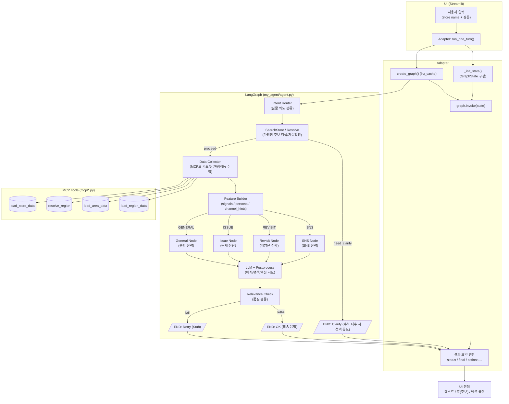

# [1014] Agent Pipeline

## Pipeline

---

```python
[사용자 입력]
     │   (store name + 질문)
     ▼
┌───────────────────┐
│ Adapter           │  ← run_one_turn(): state 초기화, graph.invoke()
└─────────┬─────────┘
          ▼
┌───────────────────┐
│ Intent Router     │  ← 질문 의도 분류(규칙 기반)
│  - SNS?           │
│  - 재방문?        │
│  - 문제진단?      │
│  - 종합전략?      │
└─────────┬─────────┘
          │
   ┌──────┼───────────┬───────────────┬───────────────┐
   │      │           │               │               │
   ▼      ▼           ▼               ▼
┌─────────────┐  ┌──────────────┐  ┌──────────────┐  ┌─────────────┐
│ SNS Node    │  │ Revisit Node │  │ Issue Node   │  │ General Node│
│ (SNS전략)   │  │ (재방문전략)  │  │ (문제 진단)   │  │ (종합전략)  │
└───────┬─────┘  └──────┬───────┘  └──────┬───────┘  └──────┬──────┘
        │               │                 │                 │
        └───────────────┴─────────────────┴─────────────────┘
                            │  (공통 마케팅 플로우)
                            ▼
┌───────────────────────────┐
│ SearchStore / Resolve     │  ← MCP: search_merchant
│ (가맹점 후보 탐색/확정)   │
└─────────────┬─────────────┘
              │
              │  후보가 여러 개?
              ├──▶ Clarify (후보 선택 유도) ──▶ [Adapter 결과 반환: need_clarify]
              │
              ▼
┌───────────────────────────┐
│ Data Collector            │  ← MCP: load_store_data / resolve_region /
│ (카드/상권/행정동 수집)   │           load_area_data / load_region_data
└─────────────┬─────────────┘
              ▼
┌───────────────────────────┐
│ Feature Builder           │  ← signals / persona / channel_hints
│ (지표/인사이트 계산)      │
└─────────────┬─────────────┘
              ▼
┌───────────────────────────┐
│ Strategy Generator (LLM)  │  ← 프롬프트 내장(노드별), 후처리(배지/면책/액션)
└─────────────┬─────────────┘
              ▼
┌───────────────────────────┐
│ Relevance Check           │  ← 길이/데이터근거/숫자/의도 키워드 검증
└─────────────┬─────────────┘
              ▼
         ✅ 최종 응답 출력
         (Adapter가 status/final/actions로 요약해 UI 렌더)

```



- LangGraph Node
    
    
    | Node ID (agent.py) | 구현(파일/함수) | 목적 | 읽는 상태키 | 쓰는 상태키 |
    | --- | --- | --- | --- | --- |
    | `router` | `my_agent/utils/nodes/router.py: RouterNode` | 사용자 질문 의도 분류 | `user_query` | `intent` |
    | `store_resolver` | `my_agent/utils/tools.py: resolve_store` | 가맹점명 → 후보 탐색/확정 | `store_name_input` | `store_candidates`, `store_id`, `need_clarify`, `error` |
    | `data_collector` | `.../tools.py: load_card_and_region_data` | 카드/상권/행정동 데이터 수집 | `store_id` | `card_data`, `area_data`, `region_data`, `error` |
    | `feature_builder` | `.../tools.py: build_features` | 신호/페르소나/채널힌트 생성 | `card_data` | `signals`, `persona`, `channel_hints`, `error` |
    | `sns` | `my_agent/utils/nodes/sns.py: SNSNode` | SNS 전략 생성(LLM) | `card_data`, `signals`, `persona`, `user_query`, `channel_hints` | `raw_response`, `final_response`, `actions` |
    | `revisit` | `.../nodes/revisit.py: RevisitNode` | 재방문 전략(LLM) | `card_data`, `signals`, `persona`, `user_query` | `raw_response`, `final_response`, `actions` |
    | `issue` | `.../nodes/issue.py: IssueNode` | 문제 진단(LLM) | `card_data`, `signals`, `user_query` | `raw_response`, `final_response`, `actions` |
    | `general` | `.../nodes/general.py: GeneralNode` | 종합 전략(LLM) | `card_data`, `signals`, `persona`, `user_query` | `raw_response`, `final_response`, `actions` |
    | `relevance_checker` | `.../tools.py: check_relevance` | 응답 품질 검증 | `raw_response`, `user_query`, `card_data`, `intent` | `relevance_passed`, `retry_count`, `error` |
- MCP Tool
    
    
    | 툴 이름 | 목적 | 필수 파라미터 | 반환(주요 키) | 호출처(노드) |
    | --- | --- | --- | --- | --- |
    | `search_merchant` | 가맹점명으로 후보 조회 | `merchant_name: str` | `found: bool`, `merchants: list[dict]` | `store_resolver` |
    | `load_store_data` | 확정 가맹점의 카드 데이터 로드 | `store_id: str` | `success: bool`, `data: dict` | `data_collector` |
    | `resolve_region` | 지역명 → 행정동 코드 매핑 | `district: str` | `success: bool`, `admin_dong_code: str` | `data_collector` |
    | `load_area_data` | 상권(상업지표) 데이터 로드 | `admin_dong_code: str` | `success: bool`, `data: dict` | `data_collector` |
    | `load_region_data` | 행정동(인구/주거 등) 데이터 로드 | `admin_dong_code: str` | `success: bool`, `data: dict` | `data_collector` |
- 예: “본죽 문제점이 뭐야?” 내부 동작 과정
    1. **UI 입력 → 어댑터 호출**
        - 사용자가 “본죽 문제점이 뭐야?” 입력.
        - Streamlit이 세션 히스토리에 `HumanMessage` 추가 후:
            
            ```python
            result = run_one_turn(
                user_query="본죽 문제점이 뭐야?",
                store_name=None,                 # (UI에서 별도 지점 입력이 있으면 전달)
                thread_id=st.session_state.thread_id,
                messages=st.session_state.messages,   # 세션 히스토리 전달(선택)
            )
            ```
            
        - 어댑터는 **state 초기화**(`_init_state`)하고, **그래프 싱글톤**을 가져옴(`_get_graph`→`create_graph` 캐시).
    2. **RouterNode → 의도 분류**
        - `RouterNode()`가 `state["user_query"]` 분석:
            - “문제/이슈/원인/진단/개선” → **ISSUE**로 판정.
        - `state["intent"] = "ISSUE"` 설정.
    3. **가맹점 확정 → resolve_store (tools 함수·그래프 노드)**
        - `store_name_input` 있으면 MCP `search_merchant` 호출.
        - 후보 다수 → `_rank_candidates`(정확일치 > prefix > 길이)로 정렬.
        - `CONFIRM_ON_MULTI == 1` & 후보>1 → `need_clarify=True`로 종료(어댑터가 `status="need_clarify"`로 UI에 반환).
        - 그 외 자동확정 → `state["store_id"]` 채우고 진행.
    4. **데이터 수집 → load_card_and_region_data (tools)**
        - MCP 툴 연쇄 호출:
            - `load_store_data(store_id)` → `state["card_data"]`
            - `resolve_region(district)` → 행정동 코드
            - `load_area_data(admin_dong_code)` → `state["area_data"]`(옵션)
            - `load_region_data(admin_dong_code)` → `state["region_data"]`(옵션)
        - 실패 시 `state["error"]` 설정 → 어댑터가 `status="error"`로 반환.
    5. **특징 생성 → build_features (tools)**
        - 카드 데이터 기반 시그널/페르소나/채널 힌트:
            - `RETENTION_ALERT`(재방문율<0.2)
            - `CHANNEL_MIX_ALERT`(배달비중≥0.5)
            - `NEW_CUSTOMER_FOCUS`(신규비중>0.4)
        - `persona`, `channel_hints` 세팅.
    6. **의도 분기 → IssueNode**
        - `intent=="ISSUE"` → `IssueNode()` 실행.
    7. **IssueNode LLM 호출 + 프롬프트 조립**
        - 노드 내부 프롬프트(내장) + `tools.build_base_context(card_data)` + `tools.build_signals_context(signals)` + `user_query`.
        - `ChatGoogleGenerativeAI` 호출 → `state["raw_response"]`.
        - `tools.postprocess_response`로:
            - 포맷 정리, **프록시/기준데이터 배지**, **액션 시드**, **면책** 추가
            - `state["final_response"]`, `state["actions"]`에 저장.
    8. **품질 검증 → check_relevance (tools)**
        - `ENABLE_RELEVANCE_CHECK`가 True면:
            - **기본 관련성**(길이/가맹점명/데이터근거/숫자 포함)
            - **ISSUE 키워드 포함 수** 검사
        - 실패 시 `relevance_passed=False`, `retry_count+=1`, `error` 기록 (현재 그래프는 그대로 종료)
    9. **어댑터 결과 요약 반환**
        - 어댑터가 `out` 상태를 해석해 아래 규격으로 변환:
            
            ```python
            {
              "status": "ok" | "need_clarify" | "error",
              "final_response": str|None,
              "actions": list,
              "store_candidates": list,   # need_clarify일 때
              "error": str|None,
              "state": out,               # 디버깅용 전체 상태
            }
            
            ```
            
        - Streamlit이 `status`에 따라 텍스트/표/경고를 렌더하고, 세션 히스토리에 `AIMessage(final_response)` push.
    
    > 한 줄 요약:
    > 
    > 
    > **UI → 어댑터(run_one_turn) → 그래프(create_graph 캐시) → Router → Resolver → Data → Features → ISSUE 노드(LLM) → 후처리/검증 → 어댑터 요약 → UI 렌더**
    > 

## Implementation

---

### 1) `my_agent/utils/nodes/`

- **`router.py`**
    
    **역할**
    
    - 사용자 질의에서 의도를 분류(SNS / REVISIT / ISSUE / GENERAL).
    - 간단한 키워드 규칙으로 1차 라우팅.
    
    **입력**
    
    - `GraphState.user_query` (str)
    
    **출력**
    
    - `GraphState.intent` (str): `SNS|REVISIT|ISSUE|GENERAL`
    
    **핵심 동작**
    
    1. 사용자 질의 소문자 변환 후 키워드 매칭.
    2. 매칭 실패 시 기본값 `GENERAL`.
    3. `state["intent"]` 설정, 그대로 반환.
- **`sns.py` / `revisit.py` / `issue.py` / `general.py`** (구조 동일)
    
    **역할**
    
    - 인텐트별 프롬프트 내장 LLM 호출 노드.
    - `card_data`, `signals`, `persona`를 받아 해당 목적의 전략/진단을 생성.
    
    **입력**
    
    - `GraphState.user_query`
    - `GraphState.card_data`
    - `GraphState.signals`
    - `GraphState.persona` (SNS만 `channel_hints`도 사용)
    
    **출력**
    
    - `GraphState.raw_response` (LLM 원문)
    - `GraphState.final_response` (후처리 텍스트)
    - `GraphState.actions` (후처리 생성 액션 시드)
    
    **핵심 동작**
    
    1. `tools.build_base_context`/`build_signals_context`로 프롬프트 조립.
    2. LLM 호출(`ChatGoogleGenerativeAI`), 실패 시 데모 문구.
    3. `tools.postprocess_response`로 배지/면책/액션 시드 반영.

---

### 2) 공용 유틸·엔진

- **`my_agent/utils/config.py`**
    
    **역할**
    
    - 환경설정 로더(.env / secrets.toml에서 값 로드).
    - 모델/키/토글/경로 일원화.
    
    **입력**
    
    - 환경변수: `GOOGLE_API_KEY`, `LLM_MODEL`, `LLM_TEMPERATURE`, `CONFIRM_ON_MULTI`, `ENABLE_RELEVANCE_CHECK`, 등
    
    **출력**
    
    - 상수: `GOOGLE_API_KEY`, `LLM_MODEL`, `LLM_TEMPERATURE`, `CONFIRM_ON_MULTI`, `ENABLE_RELEVANCE_CHECK` …
    
    **핵심 동작**
    
    - `os.getenv` 기반으로 값 로딩, 기본값 제공.
- **`my_agent/utils/state.py`**
    
    **역할**
    
    - LangGraph 공용 상태 타입(`GraphState`) 정의.
    
    **입력**
    
    - 각 노드가 읽고/쓰는 키들을 TypedDict로 정의.
    
    **출력**
    
    - `GraphState` 타입
    
    **핵심 동작**
    
    - 입력(질의/가맹점명), 라우팅(intent), 데이터(card/area/region), 분석결과(signals/persona/channel_hints),
        
        응답(raw/final/actions), 메모리(messages/summary), 제어(relevance_passed/retry_count/error) 필드를 표준화.
        
- **`my_agent/utils/tools.py`**
    
    **역할**
    
    - 파이프라인에서 필요한 대부분의 유틸/노드 로직을 함수형으로 제공.
    - 그래프에 **함수 자체를 노드**로 등록 가능(파일 수 최소화).
    
    **입력**
    
    - 함수별로 `GraphState` 혹은 dict/str 등.
    
    **출력**
    
    - 후처리 텍스트/액션, state 변환, 점수/검증결과 등.
    
    **핵심 동작**
    
    1. **helpers**
        - `normalize_store_name`, `format_percentage`, `extract_top_demographics`, `validate_card_data`, `safe_*`.
    2. **policies**
        - `should_retry`, `check_forbidden_words`, `apply_rate_limit`, 상수(`MAX_RETRIES` 등).
    3. **relevance rules**
        - `check_base_relevance`, `check_intent_specific_relevance`, `run_all_checks`, `calculate_relevance_score` …
    4. **prompt**
        - `build_base_context`, `build_signals_context`, `build_full_prompt`.
    5. **postprocess**
        - `postprocess_response`(배지/면책/액션 시드), `clean_response`, `generate_action_seed` …
    6. **data**
        - `load_card_and_region_data` (MCP 툴: `load_store_data`, `resolve_region`, `load_area_data`, `load_region_data` 호출).
    7. **feature**
        - `build_features` (signals/persona/channel_hints 생성).
    8. **resolver**
        - `resolve_store` (가맹점명 → 후보 조회/랭킹/자동확정, `CONFIRM_ON_MULTI` 분기 포함).
    9. **memory**
        - `update_conversation_memory` (messages append, summary 더미).
    10. **relevance check stage**
        - `check_relevance` (응답 품질 검증, 실패 시 `retry_count++`).
- **`my_agent/agent.py`**
    
    **역할**
    
    - LangGraph 그래프 생성(entry), 노드/엣지 정의, 체크포인트 제공.
    - **B 방식**: 함수형 노드를 직접 등록(파일 수 최소화).
    
    **입력**
    
    - 없음(그래프 스키마/노드 등록 시그니처).
    
    **출력**
    
    - `create_graph()` → 컴파일된 `graph`(invoke/run 전용).
    
    **핵심 동작**
    
    1. `StateGraph(GraphState)` 생성.
    2. 노드 등록:
        - 클래스: `RouterNode`, `SNSNode`, `RevisitNode`, `IssueNode`, `GeneralNode`
        - 함수: `resolve_store`, `load_card_and_region_data`, `build_features`, `check_relevance`
    3. 엣지/분기:
        - `router → store_resolver`
        - `store_resolver`: `need_clarify`면 `END` / 아니면 `data_collector`
        - `feature_builder`: `intent` 값에 따라 4개 노드 분기
        - 각 인텐트 노드 → `relevance_checker`
        - `relevance_checker`: pass → `END` / retry → `END`(현재 더미)
    4. 체크포인트: `MemorySaver()`로 in-memory 저장.
- **`my_agent/utils/adapters.py`**
    
    (**현재 B 방식에선 선택사항 / 없을 수 있음**)
    
    **역할**
    
    - (선택) `run_one_turn(user_query, store_name, thread_id)` 형태의 단일 호출 어댑터.
    - UI/CLI에서 쉽게 쓰도록 래핑.
    
    **입력**
    
    - `user_query`, `store_name(선택)`, `thread_id(선택)`
    
    **출력**
    
    - `{ status: "ok|need_clarify|error", final_response, actions, store_candidates, error }`
    
    **핵심 동작**
    
    - 내부에서 `create_graph()`를 1회 초기화(또는 캐시)하고, `graph.invoke(state)` 호출.
    - 결과를 UI 친화적인 dict로 요약 변환.
    
    > 만약 이 파일이 없다면, Streamlit/CLI에서 직접 create_graph() 호출 후 invoke 하면 됩니다.
    > 

---

### 3) 실행 스크립트

- **`streamlit_app.py`**
    
    **역할**
    
    - 대시보드 UI.
    - 세션 기반 챗 인터페이스 제공(히스토리/스레드ID 관리).
    - 사용자 질의 → 그래프 실행 → 결과 렌더(메시지/표/액션 플랜).
    
    **입력**
    
    - 사용자 텍스트 입력(`st.chat_input`).
    - 세션 상태:
        - `st.session_state.messages` (LangChain `HumanMessage`/`AIMessage` 리스트)
        - `st.session_state.thread_id` (랜덤 생성 스레드 식별자)
    - 정적 자원: `assets/` 이미지(로고, 히어로 이미지).
    
    **출력**
    
    - 채팅 메시지 렌더(유저/어시스턴트).
    - 상태별 부가 출력:
        - `need_clarify`: 후보 가맹점 테이블(`st.dataframe`).
        - `ok`: 최종 응답 텍스트 + 액션 플랜(확장영역).
        - `error`: 에러 메시지.
    - 사이드바: 로고/프로젝트 소개/“Clear Chat History” 버튼/디버그 정보.
    
    **핵심 동작**
    
    1. 페이지/스타일 설정: `st.set_page_config` + 인라인 CSS.
    2. 세션 초기화: `messages`/`thread_id` 세팅, 기존 히스토리 재렌더.
    3. 입력 수집: 플레이스홀더 → 사용자 질의 수신.
    4. 대화 상태 업데이트: `HumanMessage`를 세션 히스토리에 push.
    5. 파이프라인 실행
        - **방법 A(어댑터 존재)**:
            
            ```python
            result = run_one_turn(
                user_query=query,
                store_name=None,
                thread_id=st.session_state.thread_id
            )
            ```
            
        - **방법 B(직접 호출)**:
            
            ```python
            graph = create_graph()
            state = {
              "user_query": query,
              "messages": [],
              "retry_count": 0,
              "relevance_passed": False,
              "need_clarify": False,
            }
            result = graph.invoke(state)
            ```
            
    6. 결과 분기 렌더:
        - `need_clarify`: `final_response` + 후보 표.
        - `ok`: `final_response` + `actions`(있으면) 확장영역 표시.
        - `error`/예외: 경고 메시지.
    7. 히스토리 유지: 모든 어시스턴트 응답(`AIMessage`) append.
- **`local_test.py`**
    
    **역할**
    
    - CLI에서 그래프를 손쉽게 테스트.
    - 입력 문자열을 받아 한 번 실행하고 결과를 터미널에 출력.
    
    **입력**
    
    - CLI 인자 또는 `input()`으로 사용자 질의.
    - (선택) 가맹점명 문자열.
    
    **출력**
    
    - 표준 출력: 상태/최종응답/액션 요약/후보 리스트/오류.
    
    **핵심 동작**
    
    1. `create_graph()` 호출로 그래프 생성.
    2. `state` dict 준비(최소: `user_query`, `messages` 등).
    3. `graph.invoke(state)` 실행.
    4. 결과를 콘솔에서 보기 좋게 포맷팅.